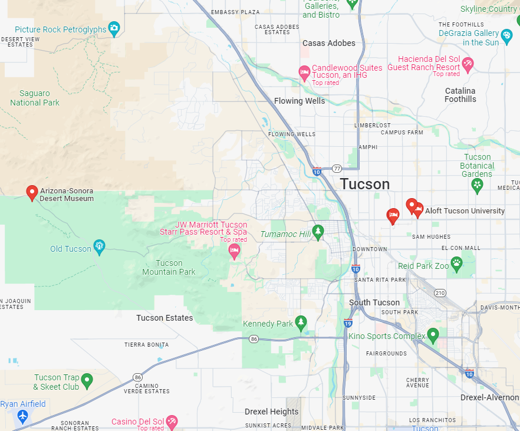

# Suggested Hotels

To help you decide, we have populated this google map with the venue location and the location of some nearby hotels:

Registration will include transport to/from the reception venue (Desert museum) from only two hotels: Tuscon Marriot University Park & Aloft Tuscon University, and the Bio5 meeting venue. 

## Group rate for GSC24 at Aloft

Marriot Bonvoy have offered a group rate at the Aloft Tucson University of 114 USD per night (plus taxes).

Please use [this link](https://www.marriott.com/events/start.mi?id=1715958041772&key=GRP) to book the GSC-group rate.

