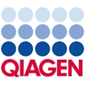
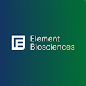
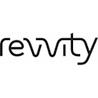
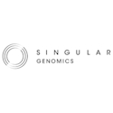
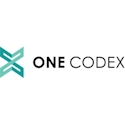

The meeting will run from: 
     **9am Tuesday August 6th through lunchtime on Friday August 9th, 2024.**

## Agenda Schedule 

* **Monday, August 5 GSC board meeting** [Bio5](https://bio5.org/)
    * 1:00-4:00 pm: Board Meeting; 5:00 pm: Board Dinner

* **Tuesday, August 6 GSC main meeting** (**8:45 am - 5:00 pm**) 
  * **Session 1: Reproducibility Challenges**
    * 9:00-9:30am: **Keynote: [Greg Caporaso](https://www.tgen.org/faculty-profiles/j-gregory-caporaso/) (Northern Arizona University, The Translational Genomics Research Institute)**
    * 9:30-9:50 [Chris Hunter](https://www.linkedin.com/in/chr1shunter/) (GigaScience) 
    * 9:50-10:10 [Susanna-Assunta Sansone](https://eng.ox.ac.uk/people/susanna-assunta-sansone/) (OICR, University
      of Oxford, UK)
    * 10:10-10:20 [Brian Coullahan](https://www.linkedin.com/in/brian-coullahan-b42b5a1/), [Element Biosciences](https://www.elementbiosciences.com)
    * 10:20-11:00	Coffee Break
    * 11:00-11:20 [João Carlos Setubal](https://www.iq.usp.br/setubal/index-en.html) (University of São Paulo)
    * 11:20-11:40 [Elisha Wood-Charlson](https://www.kbase.us/team/) (Lawrence Berkeley National Laboratory, KBase)
    * 11:40-12:00 [Taukondjo Shikongo](https://enb.iisd.org/10-years-nagoya-protocol-successes-challenges-looking-forward) [(Convention on Biological Diversity)](https://www.cbd.int)
    * 12:00-1:30 pm 	Lunch
    * 1:30-2:00 Dawn Field Award: [Savvas Paragkamian](https://imbbc.hcmr.gr/user/s-paragkamian/) (Institute of Marine Biology,Biotechnology and Aquaculture (IMBBC))
    * 2:00-3:00 pm: Reproductibility Challenges panel discussion
    * 3:00-3:30	Coffee Break & Group Photo
    * 3:30-4:45	Afternoon Working Groups  
       * CIG - MIxS standards & GA4GH experimental metadata hackathon
    * 4:45pm	  Reception transportation pickup, departing from Bio5 
    * 5:30-7:30 pm**: Opening Reception at [Arizona Sonora Desert Museum](https://desertmuseum.org/)
       * Transportation provided
         
* **Wednesday, August 7 GSC main meeting and Standards Working Groups** 
  * **Session 2: Virome Genomic Standards**
    * 9:00-9:20 [Stacy Carrington-Lawrence](https://www.nia.nih.gov/about/staff/carrington-lawrence-stacy) (NIH/NIA/ERP) - NIH Virome
      Program
    * 9:20-9:40 [Arvind Varsani](https://search.asu.edu/profile/3050059) (Arizona State University)
    * 9:40-10:00 [Simon Roux](https://jgi.doe.gov/our-science/scientists-jgi/simon-roux/) (DOE Joint Genome
      Institute)
    * 10:00-10:15 [Kris Locken](https://www.linkedin.com/in/kristopher-locken-a5a071a3/) [(Zymo)](https://www.zymoresearch.com)
    * 10:15-11:00	Coffee Break 

  * **Session 3: Omic Standards**
    * 11:00-11:20 [Ramona Walls](https://www.linkedin.com/in/ramona-walls-41aa7599/) (Critical Path Institute)
    * 11:20-11:40 [Ruth Timme](https://www.linkedin.com/in/ruth-e-timme-2615248/) (FDA, Office of Regulatory Science)
    * 11:40-12:00 [Tim Van Den Bossche](https://www.linkedin.com/in/vandenbosschetim) (Ghent University)
    * 12:00-1:00 pm	Lunch
    * 1:00-1:20 [Peter Woollard](https://www.embl.org/people/person/peter-woollard/) (EMBL-EBI)
    * 1:20-1:40 [Neil Davies](https://www.moorea.berkeley.edu/people/Neil-Davies) (Gump South Pacific Research
      Station)
    * 1:40-2:00 [Briana Benton](https://www.atcc.org/blogs/2024/taxonomic-classification-can-sometimes-be-a-strain) (ATCC)
    * 2:00-2:20	[Tianyi Wang](https://www.linkedin.com/in/tianyi-wang-3432429a/) (George Washington University)
    * 2:30-5:00 Workshops: Afternoon Working Groups
       * TDWG - CIG interactions & NMDC  Field Notes mobile app workshop
      
* **Thursday, August 8 GSC main meeting**
  * **Session 4: Challenges of ‘Omic data reuse - IMMSA** [(International Microbiome and Multi’Omics
      Standards Alliance)](https://www.microbialstandards.org/home) 
    * 9:00-9:10 [Scott Jackson](https://www.nist.gov/people/scott-jackson) (NIST - National Institute of Standards
      and Technology)
    * 9:10-9:30 [Ben Callahan](https://cvm.ncsu.edu/people/bcallah/) (NC State University, College of Veterinary
      Medicine)
    * 9:30-9:50 [Julie Dunning Hotopp](https://www.medschool.umaryland.edu/profiles/dunning-hotopp-julie-c/) (Institute for Genome Sciences, University of Maryland School of Medicine)
    * 9:50-10:30	Coffee Break
      
  * 10:30-11:00	**Keynote: [Jonathan Eisen](https://biology.ucdavis.edu/people/jonathan-eisen) (UC Davis Genome Center)**
  * 11:00-12:00 IMMSA Panel Discussion Panel: Data reuse challenges identified in the last year.
  * 12:00-1:00 pm	Lunch
    
  * **Session 5: Genomics and Standards challenges**
    * 1:00-1:20 [Melanie Culver](https://nature.arizona.edu/melanie-culver) (University of Arizona)
    * 1:20-1:40 [Dario Copetti](https://www.linkedin.com/in/dario-copetti-65ba528/) (Arizona Genomics Institute)
    * 1:40-2:00 [Ryan Bartelme](https://www.linkedin.com/in/ryan-bartelme/) (Pivot Bio)

  * 2:00-2:30 pm **Keynote: [Jack Gilbert](https://gilbertlab.ucsd.edu/) (UCSD)**
  * 2:30-3:30	Coffee Break
  * 3:30-5:00 Afternoon Working Groups: iSamples, OmicBON
   
 
* **Friday, August 9 GSC main meeting**
* 8:45 		Handoff GSC26
  * 9:00-9:30 **Keynote: [Rachel Gallery](https://nature.arizona.edu/rachel-gallery) (University of Arizona)**
  * 9:30-10:00	Coffee Break
    
  * **Session 6: Discussion of Reproducibility Challenges to Solutions**
  * 10:00-12:00	Discussion of Challenges to Solutions
  * 12:00 pm Lunch

## Thank you to our sponsors

    

     

<!-- <iframe src="https://calendar.google.com/calendar/embed?height=600&wkst=2&bgcolor=%23ffffff&ctz=Asia%2FBangkok&mode=WEEK&src=OTkwMGE0M2ZlMzJjNWE3YWU2OTVhOTdkOTRhOWQ0ZDA0Y2FlMWU5M2M5MjVlNDNmYWNlYTVmZGY1YTRhOTAzNEBncm91cC5jYWxlbmRhci5nb29nbGUuY29t&src=Z2Vuc2MtYm9hcmRAZ29vZ2xlZ3JvdXBzLmNvbQ&color=%237CB342&color=%237CB342" style="border:solid 1px #777" width="900" height="600" frameborder="0" scrolling="no"></iframe>
-->

