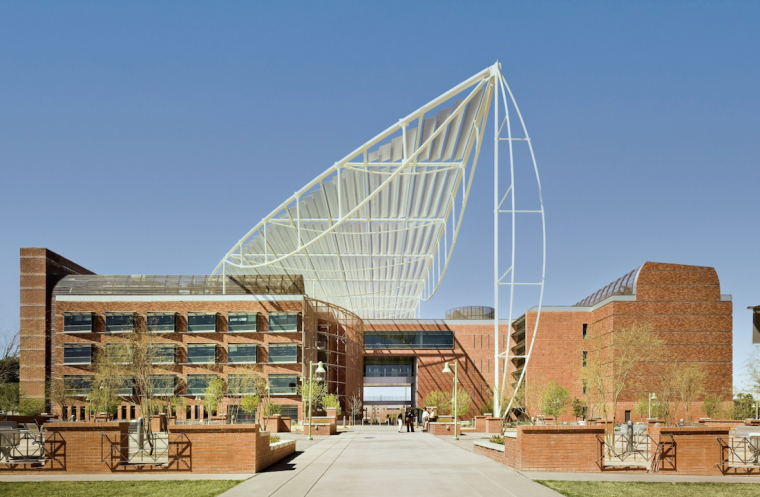

# [Bio5 Institute](https://bio5.org/)
The venue for the 24th Genomic Standards Consortium meeting will the [Bio5 Institute](https://bio5.org/) at the University of Arizona.

## Address
The University of Arizona
1657 E Helen St, Tucson, AZ 85719

Further details on the venue and accomodation will be posted here when they are available.

# [About Genomic Standards Consortium](https://www.gensc.org/)

